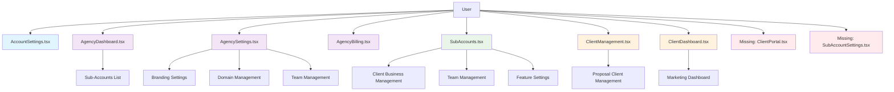
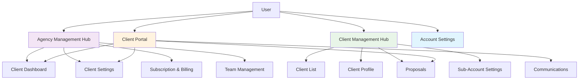
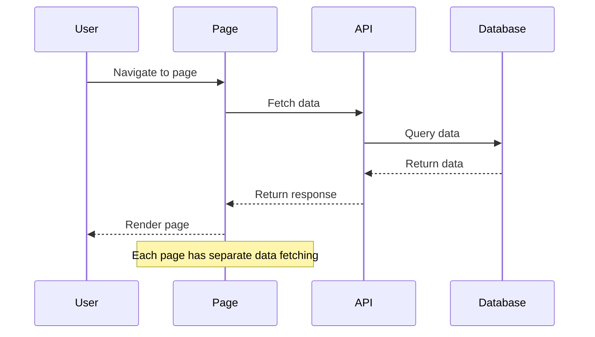
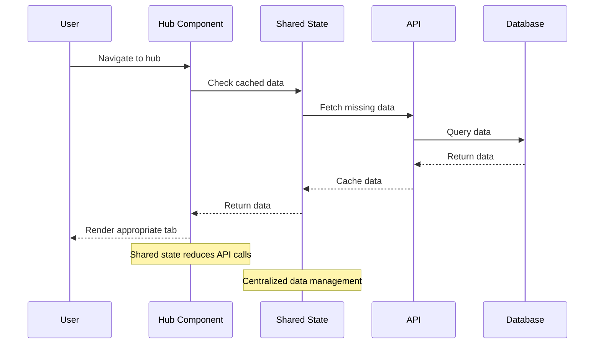

# Technical Specification: Client/Agency/Account Pages Consolidation

## Architecture Overview

### Current State Architecture


### Proposed Consolidated Architecture


## Page Consolidation Details

### 1. Agency Management Hub

**Components to Consolidate:**
- AgencyDashboard.tsx
- AgencySettings.tsx  
- AgencyBilling.tsx

**New Structure:**
```typescript
interface AgencyManagementHubProps {
  activeTab: 'dashboard' | 'settings' | 'billing' | 'team';
  agency: Agency;
  userRole: 'owner' | 'admin' | 'user';
}

// Tab Components
const AgencyDashboardTab = () => { /* Current AgencyDashboard.tsx content */ };
const AgencySettingsTab = () => { /* Current AgencySettings.tsx content */ };
const BillingTab = () => { /* Current AgencyBilling.tsx content */ };
const TeamTab = () => { /* New team management component */ };
```

**Key Features:**
- Tabbed interface within single page
- Context-aware permissions
- Unified navigation
- Shared state management

### 2. Client Management Hub

**Components to Consolidate:**
- SubAccounts.tsx
- ClientManagement.tsx

**New Structure:**
```typescript
interface ClientManagementHubProps {
  viewMode: 'list' | 'detail' | 'create';
  selectedClient?: Client | Subaccount;
  context: 'agency' | 'subaccount';
}

// View Components
const ClientListView = () => { /* Unified client/sub-account list */ };
const ClientDetailView = () => { /* Detailed client profile */ };
const ClientCreateView = () => { /* Client creation form */ };
```

**Key Features:**
- Unified client/sub-account management
- Context-aware functionality
- Proposal integration
- Team management per client

### 3. Enhanced Client Portal

**Components to Enhance:**
- ClientDashboard.tsx (enhance)
- Missing ClientPortal.tsx (create)

**New Structure:**
```typescript
interface ClientPortalProps {
  activeTab: 'dashboard' | 'proposals' | 'communications' | 'settings';
  clientId: string;
}

// Tab Components
const ClientDashboardTab = () => { /* Enhanced dashboard */ };
const ProposalsTab = () => { /* Proposal management */ };
const CommunicationsTab = () => { /* Messages, emails, calls */ };
const SettingsTab = () => { /* Client-specific settings */ };
```

**Key Features:**
- Complete client self-service portal
- Proposal tracking and management
- Communication history
- Client-specific settings

## Data Flow Architecture

### Current Data Flow


### Consolidated Data Flow


## Implementation Strategy

### Phase 1: Foundation (Week 1-2)

1. **Shared State Management**
```typescript
// Create shared state hooks
const useAgencyData = () => {
  // Shared agency data across all agency pages
};

const useClientData = () => {
  // Shared client/sub-account data
};

const useBillingData = () => {
  // Shared billing and subscription data
};
```

2. **Component Architecture**
```typescript
// Create base components
const TabbedLayout = ({ tabs, children }) => { /* Tabbed interface */ };
const ContextAwareComponent = ({ children, context }) => { /* Context-aware rendering */ };
const PermissionGuard = ({ children, permission }) => { /* Permission checking */ };
```

### Phase 2: Agency Hub (Week 3-4)

1. **Consolidate Agency Pages**
```typescript
// Create AgencyManagementHub.tsx
export default function AgencyManagementHub() {
  const { activeTab, setActiveTab } = useSearchParams();
  const { agency, userRole } = useAgencyData();
  
  return (
    <TabbedLayout tabs={['dashboard', 'settings', 'billing', 'team']}>
      {activeTab === 'dashboard' && <AgencyDashboardTab agency={agency} />}
      {activeTab === 'settings' && <AgencySettingsTab agency={agency} userRole={userRole} />}
      {activeTab === 'billing' && <BillingTab agency={agency} userRole={userRole} />}
      {activeTab === 'team' && <TeamTab agency={agency} userRole={userRole} />}
    </TabbedLayout>
  );
}
```

2. **Update Routes**
```typescript
// Update AgencyRoutes.tsx
const AgencyRoutes = () => {
  return (
    <Routes>
      <Route path="/" element={<AgencyManagementHub />} />
      <Route path="/dashboard" element={<AgencyManagementHub activeTab="dashboard" />} />
      <Route path="/settings" element={<AgencyManagementHub activeTab="settings" />} />
      <Route path="/billing" element={<AgencyManagementHub activeTab="billing" />} />
      <Route path="/team" element={<AgencyManagementHub activeTab="team" />} />
    </Routes>
  );
};
```

### Phase 3: Client Hub (Week 5-6)

1. **Consolidate Client Pages**
```typescript
// Create ClientManagementHub.tsx
export default function ClientManagementHub() {
  const { viewMode, selectedClientId } = useSearchParams();
  const { clients, subaccounts } = useClientData();
  
  return (
    <div>
      {viewMode === 'list' && <ClientListView clients={clients} subaccounts={subaccounts} />}
      {viewMode === 'detail' && <ClientDetailView clientId={selectedClientId} />}
      {viewMode === 'create' && <ClientCreateView />}
    </div>
  );
}
```

2. **Unified Client Model**
```typescript
interface UnifiedClient {
  id: string;
  name: string;
  type: 'subaccount' | 'proposal_client';
  email: string;
  phone?: string;
  industry?: string;
  status: 'active' | 'inactive';
  member_count?: number;
  proposal_count?: number;
  total_revenue?: number;
  last_contacted?: string;
  // Sub-account specific
  logo_url?: string;
  website?: string;
  city?: string;
  state?: string;
  timezone?: string;
  // Proposal client specific
  company?: string;
}
```

### Phase 4: Client Portal (Week 7-8)

1. **Create Enhanced Client Portal**
```typescript
// Create ClientPortal.tsx
export default function ClientPortal() {
  const { activeTab } = useSearchParams();
  const { clientId } = useParams();
  
  return (
    <TabbedLayout tabs={['dashboard', 'proposals', 'communications', 'settings']}>
      {activeTab === 'dashboard' && <ClientDashboardTab clientId={clientId} />}
      {activeTab === 'proposals' && <ProposalsTab clientId={clientId} />}
      {activeTab === 'communications' && <CommunicationsTab clientId={clientId} />}
      {activeTab === 'settings' && <SettingsTab clientId={clientId} />}
    </TabbedLayout>
  );
}
```

2. **Client Portal Routes**
```typescript
// Update OperationsRoutes.tsx
const OperationsRoutes = () => {
  return (
    <Routes>
      <Route path="/client-portal" element={<ClientPortal />} />
      <Route path="/portal/client" element={<ClientPortal />} />
      <Route path="/portal/client/:clientId" element={<ClientPortal />} />
    </Routes>
  );
};
```

## Migration Strategy

### Backward Compatibility
```typescript
// Create compatibility layer
const LegacyPageWrapper = ({ legacyComponent, newComponent, redirectPath }) => {
  const navigate = useNavigate();
  
  useEffect(() => {
    // Log usage of legacy pages
    console.warn(`Legacy page accessed: ${window.location.pathname}`);
    
    // Optionally redirect after deprecation period
    // navigate(redirectPath);
  }, []);
  
  return <newComponent />;
};

// Usage in routes
<Route path="/agency/dashboard" element={<LegacyPageWrapper 
  legacyComponent={AgencyDashboard} 
  newComponent={AgencyManagementHub} 
  redirectPath="/agency" 
/>} />
```

### Data Migration
```typescript
// Create data transformation utilities
const transformSubaccountToUnifiedClient = (subaccount: Subaccount): UnifiedClient => ({
  id: subaccount.id,
  name: subaccount.name,
  type: 'subaccount',
  email: subaccount.email,
  phone: subaccount.phone,
  industry: subaccount.industry,
  status: subaccount.status,
  member_count: subaccount.member_count,
  logo_url: subaccount.logo_url,
  website: subaccount.website,
  city: subaccount.city,
  state: subaccount.state,
  timezone: subaccount.timezone
});

const transformProposalClientToUnifiedClient = (client: ProposalClient): UnifiedClient => ({
  id: client.id,
  name: client.name,
  type: 'proposal_client',
  email: client.email,
  phone: client.phone,
  company: client.company,
  status: 'active', // Assume active for proposal clients
  proposal_count: client.proposal_count,
  total_revenue: client.total_revenue,
  last_contacted: client.last_contacted
});
```

## Testing Strategy

### Unit Tests
```typescript
// Test shared state hooks
describe('useAgencyData', () => {
  it('should fetch and cache agency data', async () => {
    // Test implementation
  });
  
  it('should handle permission-based data access', async () => {
    // Test implementation
  });
});

// Test consolidated components
describe('AgencyManagementHub', () => {
  it('should render correct tab based on URL', () => {
    // Test implementation
  });
  
  it('should handle tab switching', () => {
    // Test implementation
  });
});
```

### Integration Tests
```typescript
// Test data flow between components
describe('Client Management Integration', () => {
  it('should maintain data consistency across tabs', async () => {
    // Test implementation
  });
  
  it('should handle context switching correctly', async () => {
    // Test implementation
  });
});
```

### E2E Tests
```typescript
// Test user workflows
describe('Agency Management Workflow', () => {
  it('should allow agency owner to manage all features', async () => {
    // Test implementation
  });
  
  it('should restrict access based on user permissions', async () => {
    // Test implementation
  });
});
```

## Performance Optimization

### Lazy Loading
```typescript
// Implement lazy loading for heavy components
const LazyAgencyDashboard = lazy(() => import('./AgencyDashboardTab'));
const LazyBillingTab = lazy(() => import('./BillingTab'));

// Use in hub component
{activeTab === 'dashboard' && (
  <Suspense fallback={<div>Loading dashboard...</div>}>
    <LazyAgencyDashboard />
  </Suspense>
)}
```

### Caching Strategy
```typescript
// Implement intelligent caching
const useCachedData = (key: string, fetcher: () => Promise<any>, ttl: number = 5 * 60 * 1000) => {
  const [data, setData] = useState(null);
  const [loading, setLoading] = useState(false);
  
  useEffect(() => {
    const cached = localStorage.getItem(key);
    if (cached) {
      const parsed = JSON.parse(cached);
      if (Date.now() - parsed.timestamp < ttl) {
        setData(parsed.data);
        return;
      }
    }
    
    setLoading(true);
    fetcher().then(result => {
      setData(result);
      localStorage.setItem(key, JSON.stringify({ data: result, timestamp: Date.now() }));
      setLoading(false);
    });
  }, [key, fetcher, ttl]);
  
  return { data, loading };
};
```

## Error Handling

### Graceful Degradation
```typescript
// Implement error boundaries for each tab
const TabErrorBoundary = ({ children, tabName }) => {
  const [hasError, setHasError] = useState(false);
  
  if (hasError) {
    return (
      <div className="error-state">
        <h3>Unable to load {tabName}</h3>
        <p>Please try refreshing the page or contact support.</p>
        <button onClick={() => setHasError(false)}>Try Again</button>
      </div>
    );
  }
  
  return children;
};
```

### Fallback Components
```typescript
// Create fallback components for missing functionality
const FallbackComponent = ({ message = "Feature not available" }) => (
  <div className="fallback-state">
    <span>{message}</span>
  </div>
);
```

This technical specification provides a comprehensive roadmap for consolidating the client, agency, and account related pages while maintaining all existing functionality and improving the overall user experience.